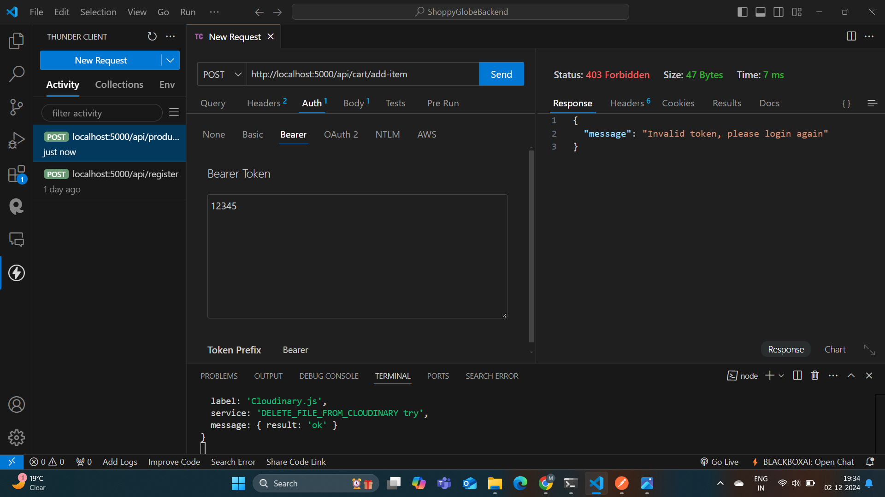

# Github repositorylink :
#    https://github.com/Mdabdur01/ShoppyGlobeBackend.git

# ShoppyGlobe E-commerce Backend - Node.js & Express.js API

# Project Overview
This project provides the backend API for ShoppyGlobe, an e-commerce application. It is built using Node.js, Express.js, and MongoDB, with key functionalities such as product management, shopping cart operations, user authentication, and more. The API is designed to handle e-commerce operations like fetching product lists, managing cart items, and securing routes with JWT-based authentication.

# Features

### 1. Product Management
- **Fetch All Products**: Retrieve a list of all available products in the database.
- **Fetch Product by ID**: Retrieve detailed information about a specific product by its ID.
- **Create a New Product**: Add a product to the database by providing image, name, price, description, and stock quantity.
- **Update an Existing Product**: Modify product details using its ID.
- **Delete a Product**: Remove a specific product from the database by ID.

### 2. Cart Management
- **Add Product to Cart**: Add a product to the shopping cart by specifying its ID and quantity.
- **Update Product Quantity in Cart**: Modify the quantity of a product in the cart using its ID.
- **Remove Product from Cart**: Remove a product from the cart by its ID.
- **Retrieve User’s Cart**: Fetch the list of products currently in a user's cart.

### 3. User Authentication
- **User Registration**: Register new users with a username, email, and password.
- **User Login**: Authenticate users and issue a JWT token for secure access to protected routes.
- **Protected Cart Routes**: Ensure only logged-in users with a valid JWT token can access cart management routes.

### 4. MongoDB Integration
- **Products Collection**:
  - Store product details, including name, price, description, and stock quantity.
  - Perform CRUD operations on the `products` collection.
- **Cart Collection**:
  - Store cart items, including product IDs and quantities linked to a user.
  - Perform CRUD operations on the `cart` collection.

### 5. API Error Handling & Validation
- **Input Validation**:
  - Validate product IDs before adding them to the cart.
  - Ensure all required fields are provided for user registration and login.
- **Error Handling**:
  - Return appropriate error messages for invalid requests.

### 6. API Testing
- All routes are tested using **ThunderClient & Postman** to ensure correct functionality.
- Screenshots of test results for each route are included in the `screenshots` folder.

# API Endpoints

### Product Routes
- **GET** `/products`: Fetch a list of all available products.
- **GET** `/products/:id`: Get detailed information for a product by its ID.
- **POST** `/api/product`: Create a new product by providing the following fields:
  - `image` (URL or file path)
  - `name` (string)
  - `price` (number)
  - `description` (string)
  - `stockQuantity` (number)
- **PUT** `/api/product/:id`: Update the details of an existing product.
- **DELETE** `/api/product/:id`: Remove a specific product from the database.

### Cart Routes
- **POST** `/cart`: Add a product to the shopping cart.
- **PUT** `/cart/:id`: Update the quantity of a product in the cart.
- **DELETE** `/cart/:id`: Remove a product from the cart.
- **GET** `/api/cart`: Retrieve products in the cart for a specific user.

### User Routes
- **POST** `/register`: Register a new user.
- **POST** `/login`: Log in a user and return a JWT token for authorization.

# Tech Stack
- **Node.js**: JavaScript runtime for backend development.
- **Express.js**: Web application framework for routing and middleware.
- **MongoDB**: NoSQL database to store products and cart items.
- **JWT (JSON Web Tokens)**: Used for secure user authentication.
- **ThunderClient & Postman**: API testing tool.

